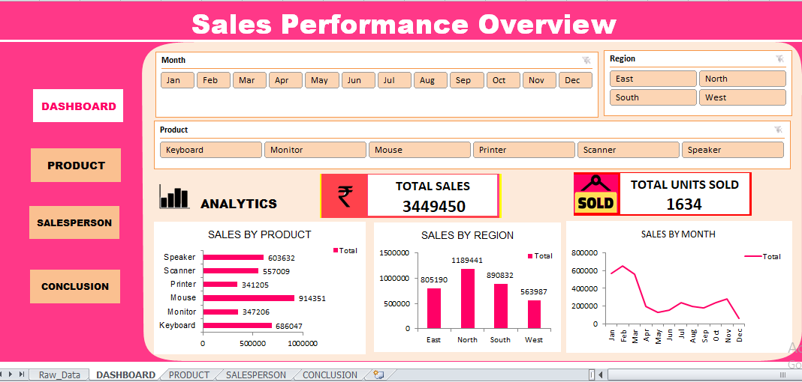
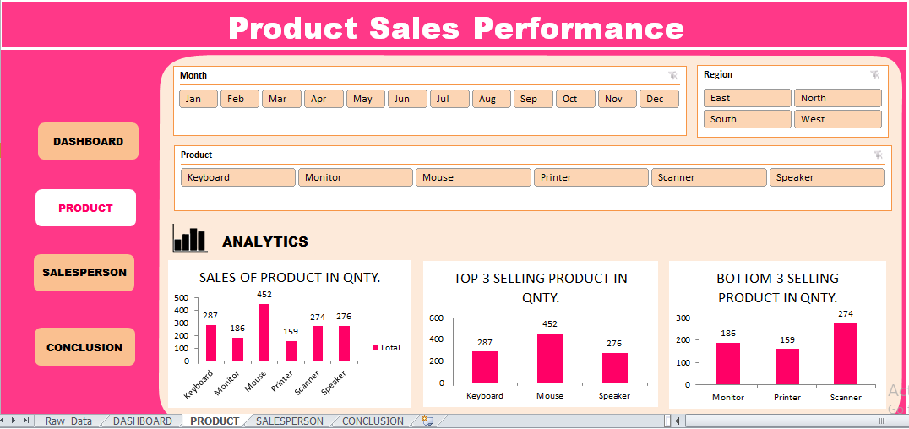
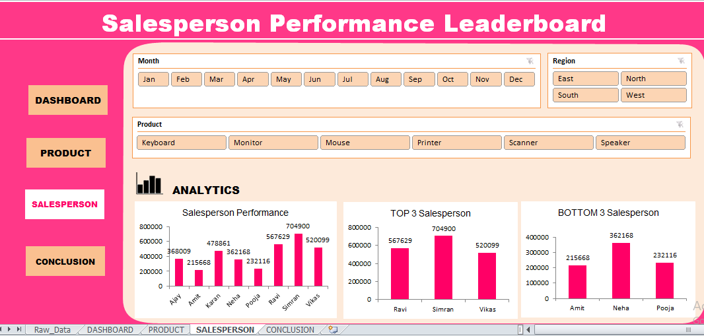
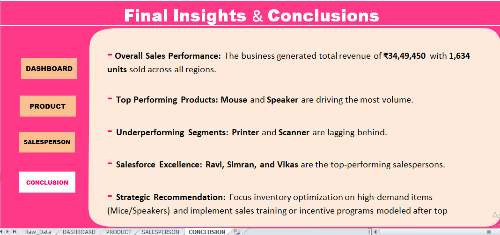

# Sales_Performance_Dashboard
An interactive Excel Sales Analytics Dashboard transforming raw commercial data into actionable insights. Features dynamic multi-sheet navigation, KPI tracking, Pivot Tables and Pivot Charts, slicers, and structured sales analysis for regional, product, monthly, and salesperson performance evaluation.

## Features
- Interactive slicers
- Pivot Tables
- Pivot Charts
- KPI Cards
- Monthly sales analysis
- Region-wise analysis
- Salesperson performance tracking

## Tools Used
- Microsoft Excel
- Pivot Tables
- Pivot Charts
- Slicers
  
## 📸 Dashboard Preview

### 1. Executive Sales Overview

### 2. Product Sales Performance

### 3. Salesforce Analytics

### 4. Final Insights & Conclusions

